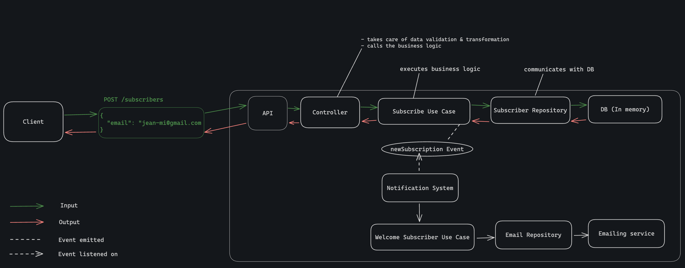
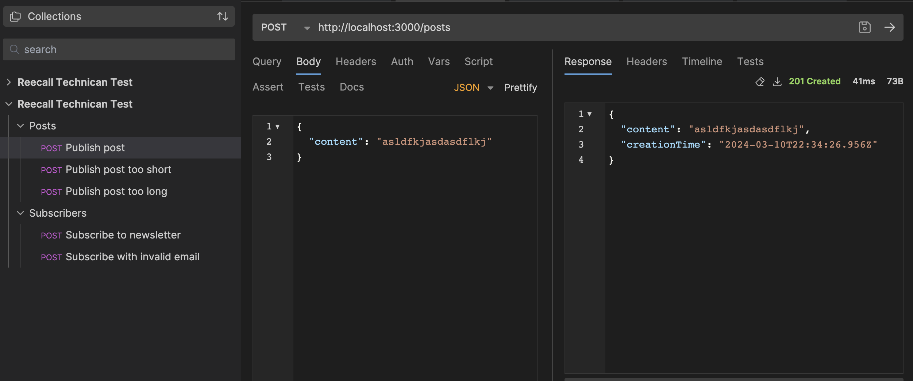

# Reecall Technical Test

## Application overview

This social application allows users to share posts anonymously.\
It works like a newsletter where users can register with their email to receive updates and publish anonymous posts that will be sent to all the registered emails.

_⚠️ Disclaimer: I intentionally did not implement any authentication or real emailing system as it was going to add complexity without bringing value regarding the evaluation criterias._

## Use cases

### User subscribes to the newsletter

An anonymous user adds its email to the newsletter.\
This will trigger the notification system, sending them a welcome email.

_🛜 Emits event : `newSubscribtion`_

### User publishes post

An anonymous user creates a text post.\
This trigger the notification system, sending the post to all the newsletter subscribers.

_🛜 Emits event : `postPublished`_

### System broadcast post

The system sends a mail containing a post to all the newsletter subscribers.

_🛜 Triggered by : [User publishes post](#user-publishes-post) via notification system listening on `postPublished`_

### System welcome subscriber

The system sends a mail welcoming a subscriber.

_🛜 Triggered by : [User subscribes to the newsletter](#user-subscribes-to-the-newsletter) via notification system listening on `newSubscribtion`_

## Design decisions

### System Architecture

I chose to write this application using [**Clean Architecture**](https://blog.cleancoder.com/uncle-bob/2012/08/13/the-clean-architecture.html).\
Even though it is overkill for a project this size, it creates a system that is highly:

- maintanable
- scalable
- testable

My choice was motivated by the great use clean architecture makes of those two principles :

**Dependency inversion principle**; this makes sure the business logic is not polluted by other concerns than business logic.\
In other words, the core logic of my application doesn't know about anything related to exterior dependencies such as database, framework, etc...\
This allows for easy testing, but also refactors and changes of libraries, frameworks, or other tools in the future.

**Single responsibility principle**; each layer of application is clearly separated and only take care of their scope of responsibility.\
And for example, I profited from the event system to respect this principle as follow : once a use case is done, it will emit an event that can trigger another mechanism or another use case.

### Event driven application

As stated before, I used the event system as a way to make sure the single responsibility principle is respected. But it also allows for the application to answer to the client as soon as possible and keep processing in the background.

For example, when a client subscribes to the newsletter, the application does two things :

- create and store a new `Subscriber`
- send a welcome email to the new subscriber

The user shouldn't have to wait for all the above to be done to receive an answer from the API.\
That's where the events comes in handy; once the `Subscribe` use case has done its thing (i.e.: create and store the new `Subscriber`), it emits the `newSubscription` event and an answer is returned to the client.\
During this time, the event is received by the notification system that distributes it to the use case responsible for sending a welcome email.

### Flow of data

The following schema illustrates the flow of data in the application.\
It uses the context of the example detailed above.



## Running the app

### 🐳 The docker way

([Docker](https://www.docker.com/get-started/) & [docker compose](https://docs.docker.com/compose/install/) required)

```bash
docker compose up
```

### ✋ The manual way

1. Install dependencies

```bash
npm ci
```

2. Run the app

```bash
npm run start
```

## Using the app

In the `tests/e2e/` folder, you can find a [Bruno](https://www.usebruno.com/downloads) and a [Postman](https://www.postman.com/downloads/) folder, each containing a collection ready to use.

⚠️ When you either subscribe or publish a new post, the application won't actually send an email but instead log the content of the email in the console along with who it is sent to.



## API Reference

The app exposes a RESTful API where :

- `POST` method is used to create
- endpoints refer to resources
- data sent or received will always be JSON

#### Add a subscriber to the newsletter

Method: `POST`\
Endpoint: `/subscribers`\
Sample body:

```json
{
  "email": "bob@gmail.com"
}
```

Responses:

- 204 - Request successful, no content returned by the API
- 400 - User error, the API will return a message explaining the error

#### Publish an anonymous post

Method: `POST`\
Endpoint: `/posts`\
Sample body:

```json
{
  "content": "Lorem ipsum dolor sit amet"
}
```

Responses:

- 201 - Resource created, the API will return the created resource
- 400 - User error, the API will return a message explaining the error
